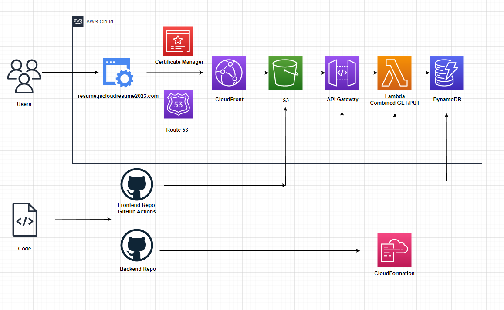

# AWS Cloud Resume Challenge
The Cloud Resume Challenge for AWS is a public, hands-on project designed to build and showcase cloud skills. In this challenge, I built a resume website hosted on AWS services, applying a variety of cloud technologies in shown in the architecture diagram below. Through developing and deploying this website, I gained valuable practical skills, underlining core concepts essential for a career in AWS cloud. The AWS Cloud Resume Challenge and other variants of it were created by Forrest Brazeal

The project calls for a blog to be created to explain the process of creating the project, skills learned, mistakes made and solved, and overall thoughts. The link to the blog is below the diagram.

## Architecture Overview

## Blog
